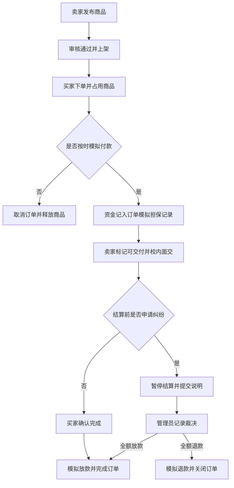

# 校园二手交易与担保履约平台

> 《微服务开发与实践》课程项目 · 程悠洋 · 2412190609

## 项目简介

本项目面向校内学生，提供闲置商品发布、下单、校内面交和模拟担保结算功能，帮助买卖双方记录交易过程，并通过明确的订单状态和简单纠纷处理协调交付与结算。本学期持续使用本仓库，先实现模块化单体，再按课程要求逐步增加认证、消息、服务拆分、监控和部署能力。

**当前阶段：第二周选题与功能规划。以下功能均为设计目标，尚未实现业务代码。**
## 业务背景与目标用户

学生在毕业、搬宿舍或更换学习用品时，经常需要转让教材、数码配件及生活用品。通过群聊交流时，商品是否已经售出、双方是否约定交付、交易是否结束等信息容易分散，出现争议时也缺少统一记录。本项目以单一校园内的二手交易为场景，用商品状态、订单记录和模拟担保结算串联交易，探索如何让交易过程可查询、可追踪、可恢复。

| 目标用户／角色 | 主要需求与权限 |
| --- | --- |
| 学生卖家 | 发布和下架自己的闲置商品，查看自己的销售订单，标记可交付并提交纠纷说明 |
| 学生买家 | 浏览商品、下单、模拟付款、确认面交完成，查询自己的订单并申请纠纷处理 |
| 平台管理员 | 审核商品、查看待处理纠纷、记录裁决理由，管理账号状态并查询操作记录 |

买家与卖家是同一个学生账号在不同交易中的身份，不要求注册两套账号。第一版将审核、纠纷处理和平台管理放在一个管理后台；管理员不能参与处理自己的交易纠纷。用户只能操作与自己有关的商品和订单，权限校验由后端执行。

## 项目目标与选题理由

1. 建立“发布—下单—模拟担保—面交—确认—放款”的完整闭环，避免只做商品信息的增删改查。
2. 用有限、可测试的规则处理商品重复购买、未付款超时取消以及结算前纠纷。
3. 围绕真实业务问题学习数据库、认证权限、消息、事务一致性和部署，而非一开始按数据表机械拆服务。

选择该题目，是因为校园交易场景容易理解，同时商品唯一占用、订单状态变化和模拟资金结算具有足够的技术挑战。

## 功能模块与交付范围

| 模块 | 具体功能 | 计划范围 |
| --- | --- | --- |
| 用户与权限 | 注册、登录、密码安全存储、学生／管理员权限、本人资源访问控制 | 第一版 |
| 商品 | 标题、描述、价格、分类和图片；发布、列表、详情；未占用商品下架 | 第一版 |
| 商品审核 | 管理员通过／驳回，记录理由；只有审核通过的商品可购买 | 本学期补齐，第一版可先简化 |
| 订单与面交 | 下单、商品占用、卖家标记可交付、买家确认完成、订单查询 | 第一版 |
| 模拟担保结算 | 每笔订单的模拟付款、担保金额、放款记录；避免重复处理 | 第一版完成正常流程，本学期补齐异常处理 |
| 取消与纠纷 | 未付款超时取消、释放占用；结算前提交纠纷说明；管理员全额退款或放款 | 本学期补齐 |
| 通知与审计 | 订单状态站内通知、失败重试；记录关键操作及裁决理由 | 本学期补齐 |
| 评价与收藏 | 成交后评价、商品收藏 | 时间充裕再做，不阻塞核心验收 |

## 核心业务流程

以下图中的“付款”和“放款”都是模拟台账变化。简化审核可以在第一版使用后台操作完成。

### 关键业务规则

- **单件交易：**每条商品记录代表一件闲置，一笔订单只购买一件商品；固定价格、不议价、不合单。禁止购买自己的商品。
- **唯一占用：**同一商品同一时刻只能被一个有效订单占用；下单时保存价格和商品描述快照，商品后续修改不能改变历史订单金额。
- **未付款取消：**超时前未付款的订单取消并释放占用。支付与超时并发时必须校验当前状态；取消后到达的付款结果不能直接恢复订单，进入模拟退款或待处理流程。
- **交付和确认：**本学期仅支持校内面交。卖家标记可交付后，由买家确认完成；不做自动确认收货。买家长期不确认时由管理员按纠纷规则处理。
- **结算前纠纷：**付款后、结算前可申请；申请成功后暂停放款。买家确认与纠纷申请竞争时只能接受一个有效状态转换。
- **有限裁决：**只支持全额退款或全额放款，不做部分退款、多轮申诉和结算后追偿。涉及实物退回时，管理员在记录交接说明后再裁决；系统不自动判断实物是否退回。
- **商品恢复：**未付款取消可自动恢复可售；付款后退款不自动上架，避免商品已经交付却被再次出售，需卖家核实后重新发布。
- **模拟资金：**只记录订单担保金额，不做充值、提现或通用钱包。退款和放款不得重复执行，且不可对同一笔担保同时全额执行。
- **基本核对：**不考虑手续费时，每笔订单的累计担保入账应等于当前担保余额、累计退款和累计放款之和；记录必须可追踪，金额不得为负。
- **权限：**买家、卖家和管理员只能执行各自允许的状态转换。隐藏页面按钮不能代替后端权限校验。

## 当前范围与暂不实现的内容

本学期以单校园、学生个人闲置、固定价格、单件订单、面交和模拟资金为边界。第一版只保证正常交易闭环；超时取消、简单纠纷、可靠消息和服务拆分分阶段增加。

暂不接入真实支付和真实身份核验服务；注册登录及角色权限属于本学期范围。暂不实现物流配送、通用钱包、拍卖、跨校交易、实时聊天、推荐算法和信用评分。这些功能会增加渠道接入、数据需求或业务分支，不作为本学期验收承诺。平台仅记录教学模拟交易，不声称能够消除现实交易风险。

## 技术演进方向

计划使用 Java / Spring Boot、关系型数据库和网页界面。先做模块化单体，不在选题阶段固定所有框架版本；实现前再核对兼容性。消息队列只选择一种，部署采用本地 Docker Compose。

| 课程能力 | 本项目中的具体应用 |
| --- | --- |
| 数据库持久化 | 保存用户、商品、订单、担保记录和纠纷；用约束与事务维护唯一占用 |
| 认证与权限 | 登录认证、管理员权限、买卖双方对本人资源的访问控制 |
| 并发与本地事务 | 防止同一商品被重复购买，校验订单状态，保护担保结算记录 |
| 消息 | 订单变更后发送站内通知，处理重复消息和发送失败 |
| 跨服务一致性 | 先选一条订单与结算流程，明确中间状态、重试、幂等及异常核对 |
| 监控 | 健康检查、请求／订单关联日志、待处理结算和消息失败指标 |
| 部署 | Docker Compose 启动服务、数据库及消息队列，提供演示数据和运行说明 |

单体稳定后，按课程进度逐步拆分为最多三个业务服务：

| 服务 | 数据与职责边界 |
| --- | --- |
| 用户与商品服务 | 用户认证资料、商品发布审核、商品占用与售出状态 |
| 交易履约服务 | 订单、面交、纠纷、裁决；决定是否具备结算条件 |
| 担保结算服务 | 模拟入账、冻结、退款、放款及核对；保证资金操作不重复 |

服务之间通过接口或事件交互，不直接修改对方的数据表。初期可共用一个数据库实例，但拆分后各服务拥有独立的数据范围。通知先作为内部模块，不为增加服务数量单独拆分。

## 16 周计划

| 阶段 | 计划成果 |
| --- | --- |
| 第 1—2 周 | 环境准备、唯一选题、README、业务规则与功能规划；第一周记录见下方链接 |
| 第 3—4 周 | 数据模型、登录、商品发布查询、最小网页界面 |
| 第 5—6 周 | 下单占用、模拟担保付款、面交确认和放款，演示正常闭环 |
| 第 7—8 周 | 简单审核、超时取消、纠纷及全额退款／放款 |
| 第 9—10 周 | 关键权限、并发、重复请求测试；明确模块接口并开始拆分 |
| 第 11—12 周 | 最多三个业务服务、可靠消息、失败重试与一致性核对 |
| 第 13—14 周 | 基础监控、Docker Compose、演示数据及运行文档 |
| 第 15—16 周 | 集成验收、缺陷修复、截图和课程展示，不再新增大模块 |

这是计划而非已完成功能清单。若进度不足，先取消评价、收藏、统计及界面美化，优先保证闭环、权限、关键异常处理和课程必需技术任务；必要时结合老师实际授课安排调整周次。

## 计划验收场景

1. 完成一笔发布、下单、付款、面交、确认和放款的模拟交易。
2. 两名买家同时下单同一商品，最多一个成功占用。
3. 未付款订单超时后释放商品；迟到付款结果不会使已取消订单恢复。
4. 对付款或放款操作重复提交，不会出现重复入账或重复放款。
5. 申请纠纷后阻止普通放款；裁决只执行一次，并记录理由。
6. 用户无法查看或修改其他无关用户的订单及纠纷材料。
7. 消息处理失败后可以重试，重复消息不会造成重复业务变更。
