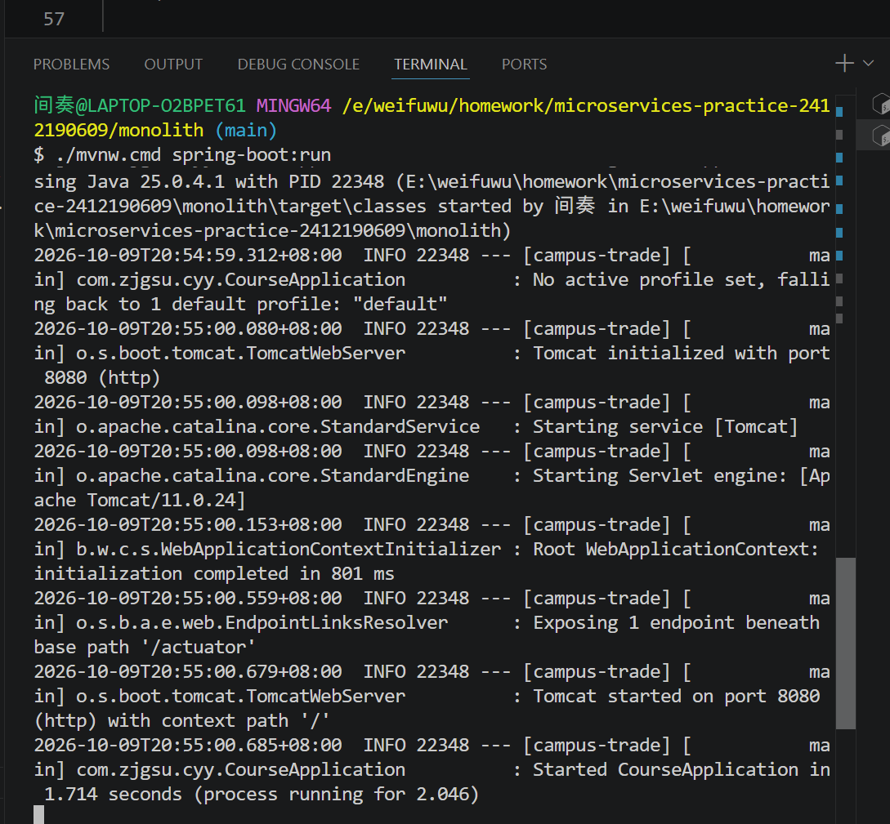
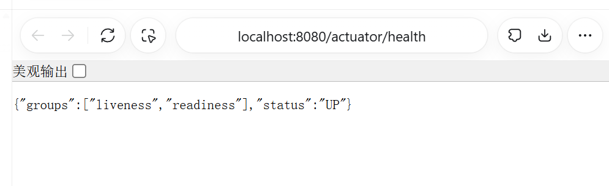
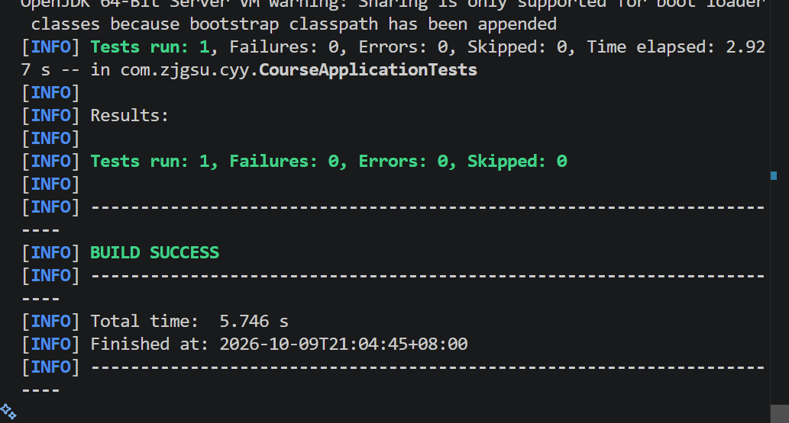

# 第三周作业：Spring Boot 工程初始化与运行验证

- 项目：校园二手交易与担保履约平台
- 姓名：程悠洋；学号：2412190609
- 仓库：https://github.com/jz0530/microservices-practice-2412190609
- [选题与模型规划](../../project-proposal.md)
- [根目录运行说明](../../../README.md)

## 本周计划与完成内容

沿用第二周选题，在仓库根目录 monolith 中建立一个完整 Maven 工程。准备优先实现“卖家发布商品、买家浏览下单”的业务场景，规划商品、订单两个模型；本周只实现启动验证，不编写业务 CRUD、Service、Repository 或数据库访问。

已配置 Java 25、Spring Boot 4.0.8、Spring Web MVC、Actuator；Group 与源码／测试包名均为 com.zjgsu.cyy。应用名称 campus-trade，配置文件 src/main/resources/application.yml，端口 8080。保留 Spring Initializr 生成的 Maven Wrapper 和 contextLoads 测试。

## 工程结构

```text
monolith/
├── pom.xml
├── mvnw
├── mvnw.cmd
├── .mvn/wrapper/maven-wrapper.properties
└── src/
    ├── main/java/com/zjgsu/cyy/CourseApplication.java
    ├── main/java/com/zjgsu/cyy/HelloController.java
    ├── main/resources/application.yml
    └── test/java/com/zjgsu/cyy/CourseApplicationTests.java
```

## 启动与接口验证

从仓库根目录进入 monolith。已配置 Java 25 环境后，Linux／WSL 执行：

```bash
cd monolith
./mvnw spring-boot:run
```

本机 Windows 的 Git Bash 使用 `./mvnw.cmd spring-boot:run`；CMD 使用 `mvnw.cmd spring-boot:run`。D 盘缓存配置见根目录 README。

2026-10-09 在 monolith 目录实际启动，日志显示 `Tomcat started on port 8080` 和 `Started CourseApplication in 1.714 seconds`。浏览器实际验证：

| GET 地址 | 响应 |
| --- | --- |
| http://localhost:8080/api/hello | 你好，校园二手交易与担保履约平台！ |
| http://localhost:8080/actuator/health | status 为 UP；本次页面同时显示 groups 为 liveness、readiness |

上述结果来自当日运行日志与浏览器截图。应用必须保持运行才能访问；Ctrl+C 可停止服务。

## 启动测试

测试类 CourseApplicationTests 使用 `@SpringBootTest`，包含 `@Test void contextLoads()`，验证应用上下文可以加载，不代表业务功能测试已完成。

在 monolith 内执行：

```bash
./mvnw test
```

Windows Git Bash 对应 `./mvnw.cmd test`，CMD 对应 `mvnw.cmd test`。

2026-10-09 在当前 monolith 工程重新执行测试，结果为 Tests run: 1, Failures: 0, Errors: 0, Skipped: 0，BUILD SUCCESS。完整输出见 [test-result.txt](test-result.txt)。

## 截图与后续工作

以下截图记录本次运行与测试结果；测试结果截图时间为 2026-10-09 21:04。








本周仅完成工程基础能力；注册登录、商品交易、订单、模拟担保、数据库、Service、Repository 等尚未实现，按后续课程安排推进。